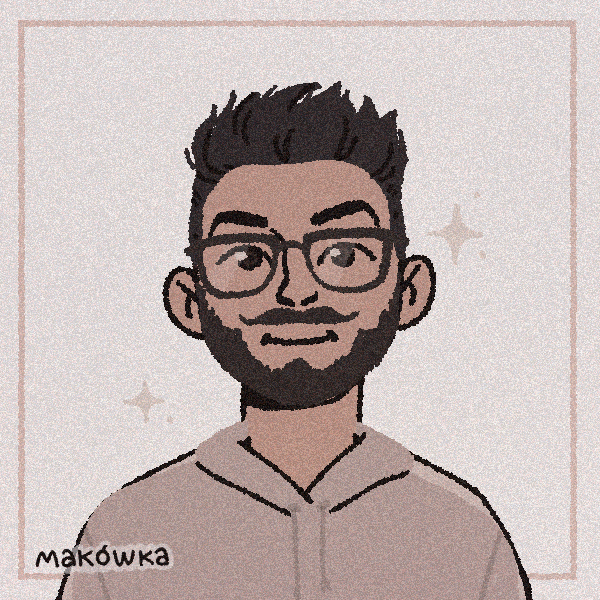

<h2> Hi, I'm Mario Lima! </h2>

<p><em>Frontend Developer at <a href="http://www.marcasite.com.br">Marcasite Agência Digital</a>
</em></p>

[](https://www.linkedin.com/in/mario-augusto-de-lima-a9791819b/)
[](https://github.com/limaCoder)


###  A little more about me...  

```javascript
const mario = {
  pronouns: "he" | "his",
  code: [Javascript, Typescript, HTML, CSS],
  tools: [React, Nextjs, Node, Sass, Styled-Components, Bootstrap],
  challenge: "Become a better developer every day"
}
```

 <em><b>I love connecting with different people</b> so if you want to say <b>hi, I'll be happy to meet you more!</b> :)</em>

---
